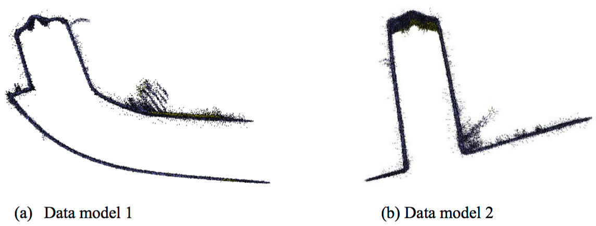
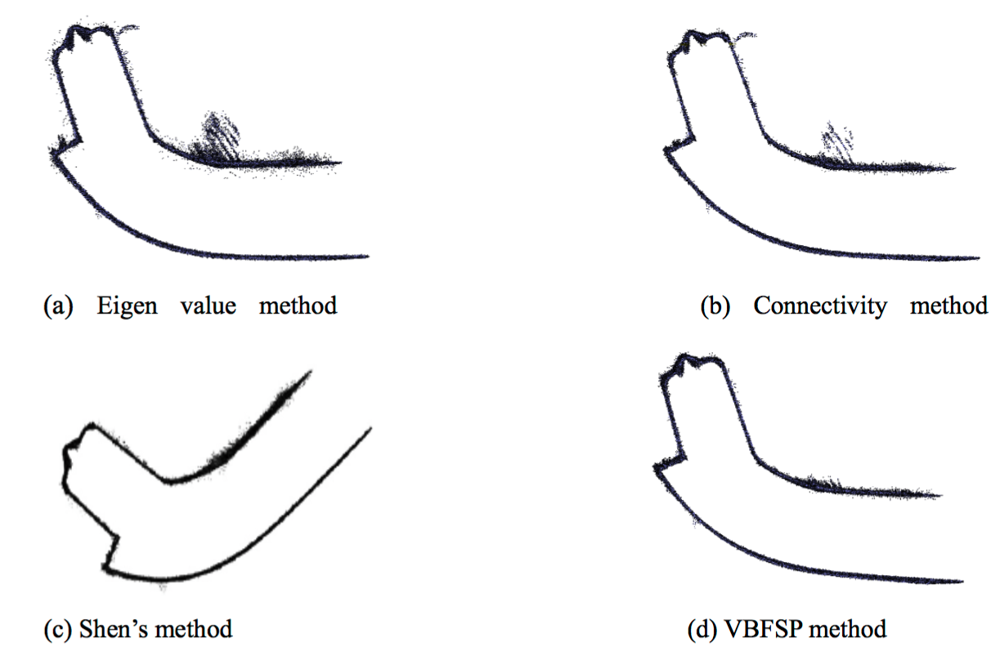
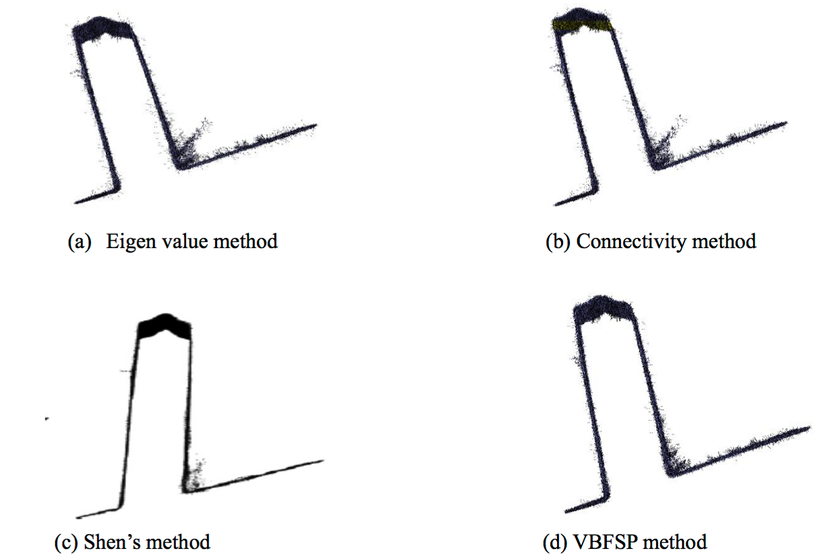

Denoiser
===============

Code accompanying the paper [“Fast Voxel-based Surface Propagation Method for Outlier Removal”](http://www.cadconferences.com/CAD16_284-289.html#.WRR6E2WlJJ1)

## Experiment results

### Data models which have non-isolated and sharp featured surface outlier clusters

### Data model 1 processed by various methods

### Data model 2 processed by various methods.

## Reference

If you found this code useful, please cite the following paper:

Yu Chen, Hao Chen and Jie Shen. **"Fast Voxel-based Surface Propagation Method for Outlier Removal."** *In Proceedings of the 13th International CAD Conference, Vancouver, BC, Canada. June 27-29, 2016.

    @inproceedings{yu2016fast,
      title={Fast Voxel-based Surface Propagation Method for Outlier Removal},
      author={Yu Chen, Hao Chen and Jie Shen},
      booktitle ={CAD},
      year={2016},
      volume={14},
      pages={284-289}
    }
